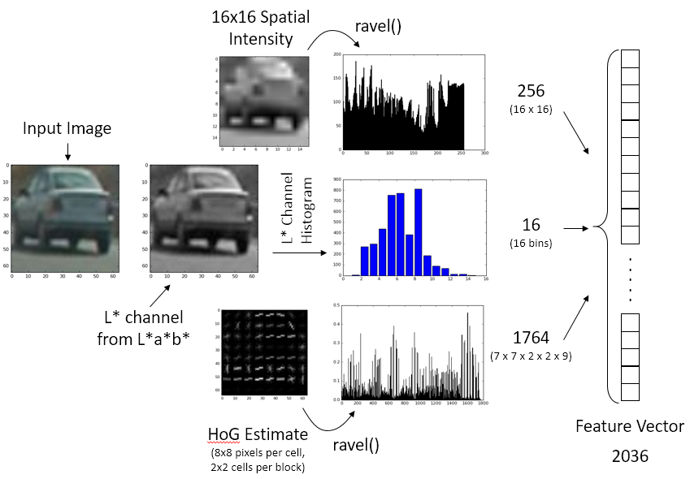
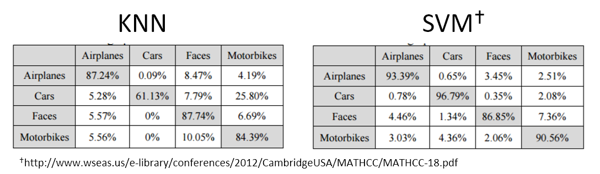
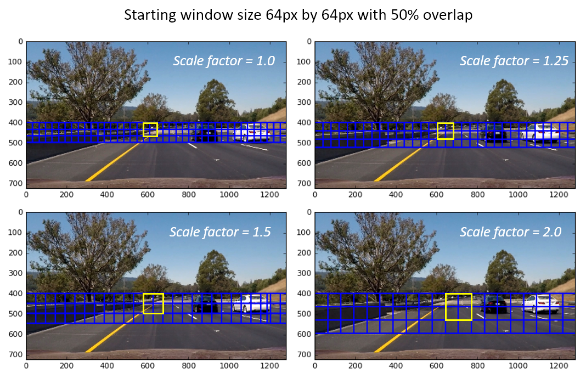
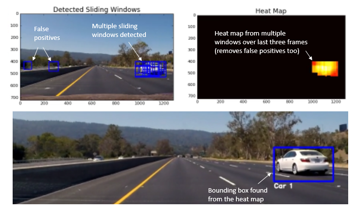
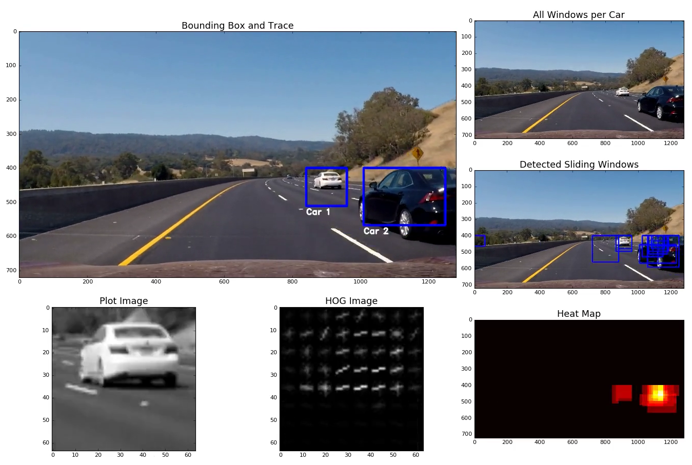

# Vehicle Detection and Tracking

This repot for the vehicle detection and tracking project is divided into six different sections. An overview of the contents is provided below. In the first section, ***feature extraction*** procedure is described. In the second section, the methodology and steps for ***training*** a support vector machine (SVM) using normalized training feature and label data is discussed. In the third section, the ***sliding window*** implementation is discussed. In the same section, the philosophy of identifying the pixels corresponding the cars using ***heat maps*** is presented. In the fourth section, the strategy adopted for ***visualization*** is presented. In the final section, ***results*** and some discussion on potential improvements to the implementation are also discussed. The implementation of the code is presented in file *vehicle_detection_v2.py*.

---

***Table of contents***

- [Feature Vector Extraction](#feature-vector-extraction)
  - [A note on selection of colorspace](#a-note-on-selection-of-colorspace)
- [Classifier Selection and Training](#classifier-selection-and-training)
- [Sliding Window Search](#sliding-window-search)
  - [Heat Maps](#heat-maps)
- [Visualization and Video Implementation](#visualization-and-video-implementation)
- [Discussion](#discussion)

---

## Feature Vector Extraction

In order to train or predict, it is essential to build an input vector that represents the key features of a car. In the following, the procedure used to extract the feature vector that describes the image of a car as uniquely as possible is described.

### A note on selection of colorspace

The human perception is best described by the CIE L\*a\*b\* colorspace. For the purpose of feature extraction on the lightness (L*) channel is used. The color information was from a\* (green-red axis) and b\* (blue-yellow axis) was not utilized. It was found that the lightness channel itself is sufficient to provide a reasonable estimate. Futhermore, this helped keep the dimension of the feature vector smaller and improved performance during training using the complete image dataset.

Key steps performed in feature extraction pipeline are listed below. An overview of the process is also shown in the following figure along with example images.

* Convert the 64x64 pixels input image to CIE L\*a\*b\* colorspace using `cv2.cvtColor(img, cv2.COLOR_RGB2LAB)`.
* Process 16x16 spatial intensity vector from L\* channel using `cv2.resize(img_L, (nspatial, nspatial)).ravel()`.
* Obtain the L\* channel histogram with 16 bins using `np.histogram(img_L, bins=nhistbin, range=(0, 256))[0]`.
* Extract HoG features using 8x8 pixels per cells, 2x2 cells per block and 9 orientation bins. This produces a HoG feature vector of length 1764 [ `(pixels_per_cell-1)^2 * cells_per_block^2 * num_orientations` ].
* All these vectors are assembled adjacent to each other producing the input feature vector of size 2036. The feature vector is scaled for zero mean and unit variance using a `sklearn.preprocessing.StandardScaler()` before using it in the training or prediction process.

## Classifier Selection and Training
For the purpose of training and prediction using the feature vector described above, Support Vector Machines (SVM) was chosen as it has the best accuracy to computation cost ratio. As shown using the data from Kim *et. al.* in the below table, the SVM outperforms other methods, especially in the task classifying objects like cars, with a very high accuracy, precision and recall.

For training the classified, the complete dataset of 17,760 points was used. The data is split into training and testing data using `sklearn.model_selection.train_test_split()` function with 80% to 20% split, respectively. The following table shows the performance of the trained SVM classifier. The subsequent table shows the confusion matrix, giving details on how accuracy, precision and recall were ascertained.

| Metrics for Training the SVM Classifier | Value                                  |
| --------------------------------------- | -------------------------------------- |
| Total number of training points         | 14208  [ Cars: 7051 / Not Cars: 7157 ] |
| Total number of test points             | 3552 [ Cars: 1741 / Not Cars: 1811 ]   |
| Accuracy                                | 96.06%                                 |
| Precision                               | 95.52%                                 |
| Recall                                  | 66.40%                                 |
| Time to train the SVM classifier        | 7.73 sec                               |

| n = 6552           | Predicted (TRUE) | Predicted (FALSE) | *Totals*   |
| ------------------ | ---------------- | ----------------- | ---------- |
| **Actual (TRUE)**  | 1750             | 78                | *1828*     |
| **Actual (FALSE)** | 62               | 1662              | *1724*     |
| ***Totals***       | *1812*           | *1740*            | ***6552*** |

## Sliding Window Search

The sliding window search methodology used to identify cars in each frame of the video is described. In order to improve computational efficiency, sliding window techniques was applied on *<u>two</u>* rows of scaled windows, that increased in size gradually. Since cars appear smaller in the frame near the horizon and larger when closer, such a scheme gave excellent computational advantage. The starting window size was chosen to be 64px by 64px, which was found to be ideal to identify cars that were a sufficiently safe distance from the car. Four additional window scaling factors were used: 1.25x, 1.5x, 1.75x, 2.0x. The sliding windows were parametrized by the overlap fraction, and location of each window was computed *apriori* using the function `sliding_window_list()` in the source file. This function takes the input video frame, region of interest and window overlap fraction as input arguments and return a list of all the overlapping windows at various scales. The following image illustrates some of the window sizes and highlights size of each window using a yellow box. The yellow box traverses across the width of the image and the two rows. As can be seen in the figure, the overlap to the next step along the width and height directions is 50%.

###Heat Maps

When searching the frame using the sliding window method, there are usually multiple detection per car. Furthermore, there are false positives that are detected on the guard rail and the vegetation along the side of the road. In order to improve the accuracy of tracking and removing false positives, the following strategies were adopted:

1. A heat map was created using multiple detection - each detected window (at all scales) adds 1 unit to the heat map for all of its pixels. For each frame, the heat map is computed as an aggregate sum pixels from all detected windows.
2. Heat maps from previous video frames are also stored in memory using a `deque` datastructure. This a list of fixed maximum length which performs like a ring-buffer or a FILO buffer. This allows to retain the last 3 heat maps with only one line of code : `heat_maps.append(heat)`, where `heat_map` is a `deque` object.
3. During the current frame, a mask is created from the heat maps from previous 3 frames using `numpy.logical_and` operation. Using this mask, 5 units per pixel are added. This makes sure that extra heat is added for pixels that had been consistently identified as cars over the last three frames, and hence filter out transient false positives.
4. Once the mask is used to add extra heat to current frame, all the detection which carry less that 4 units of heat are filtered out. All these operations are done within lines 111-117 of the source file (vehicle_detection_v2.py).
5. Finally, using the filtered heat map in the current frame, bounding box for the car or various cars is determined using the `scipy.ndimage.measurements.label` function. The bounding box around each identified car is drawn.

The following figure illustrates the multiple detections and false positives, and subsequently processed using the above filtering steps to identify the final bounding box.

## Visualization and Video Implementation

The following image shown a single frame from the visualization video. The visualization frame projects all key steps of the processing as described above. Feature detection using HoG, multiple detection, heat maps processing and final identification of bounding box for multiple cars is visualized in a single frame. The final project video can be download from [here](./project_output.mp4).

The detection and visualization for an example key sections of the project_video.mp4 frame is shown below. It can be seen that the pipeline described above is very effective in removing false positives and also detection multiple cars within a single frame.

## Discussion

The vehicle detection project was a very interesting project to implement. It was very interesting to see the power to HOG features + SVM classification technique to detect cars. The process described in the lecture videos was adapted slightly - and parameter set was explore. Some of the key challenges encountered during the project are listed below. Also, improvement that can be done are also listed, and will be revisited in due course of time.  

1. The choice of colorspace seems to have marginal effect on the performance. Intensity based colormaps such as CIELAB, HSV, HSL, YCbCr are also found to give similar performance. A good improvement in training and prediction performance was seen by only using lightness (L\*) channel from CIELAB. Due to the lack of good color information in training set, other channels were found not so useful.
2. The choice of window scales had a significant effect on the relative change in heat maps. If may scales between 1.0-1.5 were chosen, the number of false detections and multiple detections increased exponentially. Other strategies such as time-based mask had to be employed to get useful results.
3. Alternate feature vector needs to be explore to increase the training accuracy to 98-99%, in order to reduce the false positives. The large majority of false-positives were observed over the guard-rail, which seems to have a similar HOG pattern as the cars. The HOG binning and cells/blocks parameters can be tuned further.

